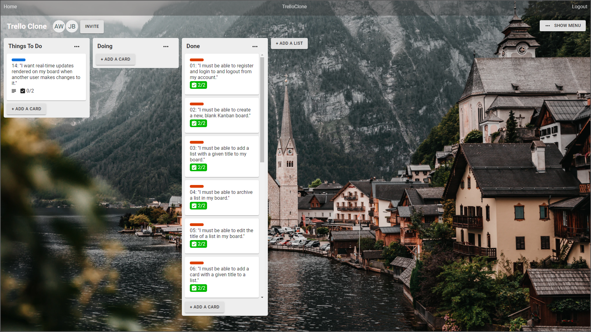

# TrelloClone

https://aw-trello-clone.herokuapp.com/

A Trello clone built using the MERN stack.

The Trello board I used to organise this project's workflow: 
https://trello.com/b/2rP2cJBz/trello-clone

"I used Trello to clone Trello."
\- Archawin Wongkittiruk (2020)

Major credits to this Udemy course by Brad Traversy for laying the groundwork for my understanding of the MERN stack: https://www.udemy.com/course/mern-stack-front-to-back/
